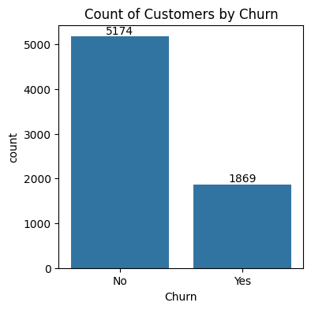
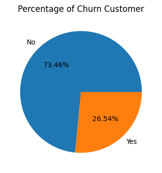
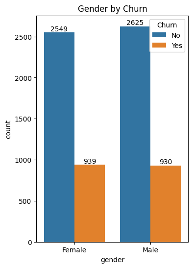
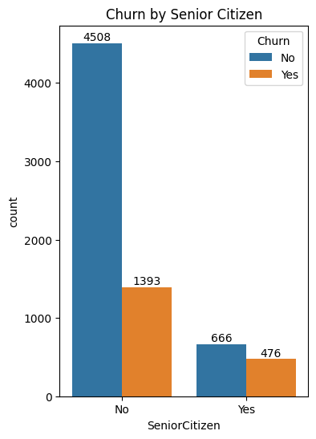
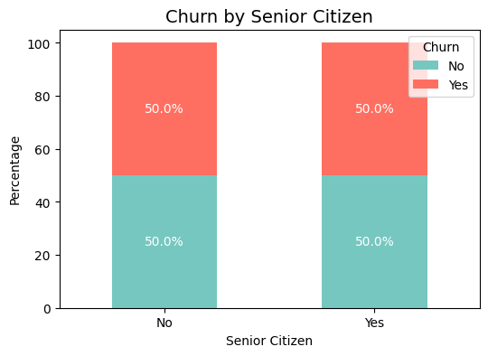
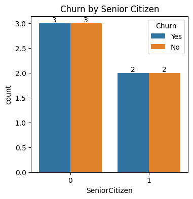
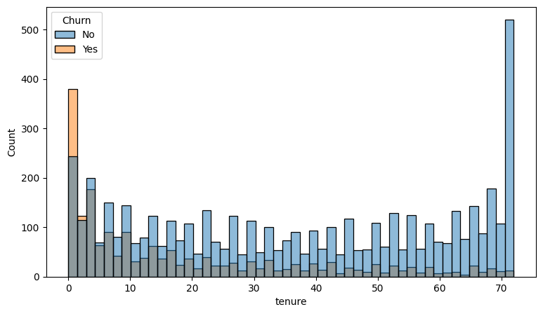
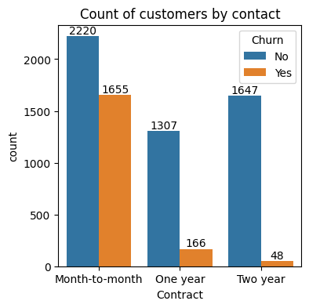
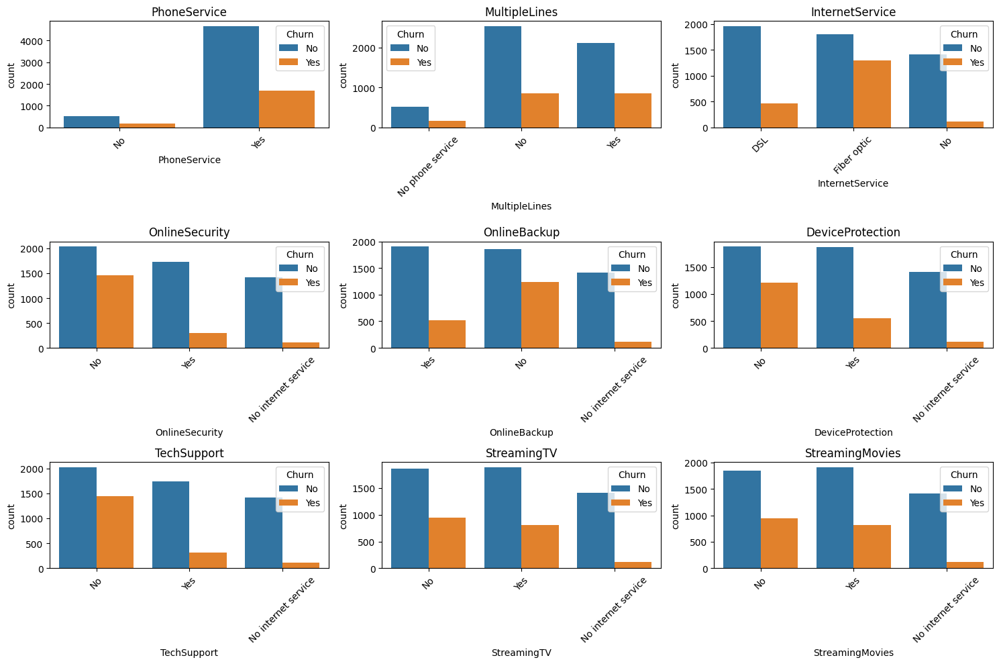
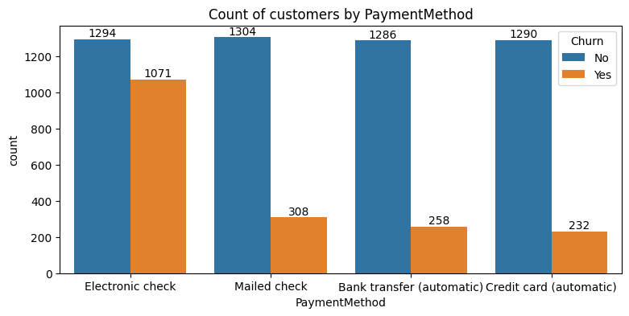

# churn_analysis

```python
import numpy as np 
import pandas as pd
import matplotlib.pyplot as plt 
%matplotlib inline
import seaborn as sns
```


```python
df = pd.read_csv (r"E:\Project\12.CHURN ANALYSIS\Customer Churn.csv")
```


```python
df.info
```


    <bound method DataFrame.info of       customerID  gender  SeniorCitizen Partner Dependents  tenure  \
    0     7590-VHVEG  Female              0     Yes         No       1   
    1     5575-GNVDE    Male              0      No         No      34   
    2     3668-QPYBK    Male              0      No         No       2   
    3     7795-CFOCW    Male              0      No         No      45   
    4     9237-HQITU  Female              0      No         No       2   
    ...          ...     ...            ...     ...        ...     ...   
    7038  6840-RESVB    Male              0     Yes        Yes      24   
    7039  2234-XADUH  Female              0     Yes        Yes      72   
    7040  4801-JZAZL  Female              0     Yes        Yes      11   
    7041  8361-LTMKD    Male              1     Yes         No       4   
    7042  3186-AJIEK    Male              0      No         No      66   
    
         PhoneService     MultipleLines InternetService OnlineSecurity  ...  \
    0              No  No phone service             DSL             No  ...   
    1             Yes                No             DSL            Yes  ...   
    2             Yes                No             DSL            Yes  ...   
    3              No  No phone service             DSL            Yes  ...   
    4             Yes                No     Fiber optic             No  ...   
    ...           ...               ...             ...            ...  ...   
    7038          Yes               Yes             DSL            Yes  ...   
    7039          Yes               Yes     Fiber optic             No  ...   
    7040           No  No phone service             DSL            Yes  ...   
    7041          Yes               Yes     Fiber optic             No  ...   
    7042          Yes                No     Fiber optic            Yes  ...   
    
         DeviceProtection TechSupport StreamingTV StreamingMovies        Contract  \
    0                  No          No          No              No  Month-to-month   
    1                 Yes          No          No              No        One year   
    2                  No          No          No              No  Month-to-month   
    3                 Yes         Yes          No              No        One year   
    4                  No          No          No              No  Month-to-month   
    ...               ...         ...         ...             ...             ...   
    7038              Yes         Yes         Yes             Yes        One year   
    7039              Yes          No         Yes             Yes        One year   
    7040               No          No          No              No  Month-to-month   
    7041               No          No          No              No  Month-to-month   
    7042              Yes         Yes         Yes             Yes        Two year   
    
         PaperlessBilling              PaymentMethod MonthlyCharges  TotalCharges  \
    0                 Yes           Electronic check          29.85         29.85   
    1                  No               Mailed check          56.95        1889.5   
    2                 Yes               Mailed check          53.85        108.15   
    3                  No  Bank transfer (automatic)          42.30       1840.75   
    4                 Yes           Electronic check          70.70        151.65   
    ...               ...                        ...            ...           ...   
    7038              Yes               Mailed check          84.80        1990.5   
    7039              Yes    Credit card (automatic)         103.20        7362.9   
    7040              Yes           Electronic check          29.60        346.45   
    7041              Yes               Mailed check          74.40         306.6   
    7042              Yes  Bank transfer (automatic)         105.65        6844.5   
    
         Churn  
    0       No  
    1       No  
    2      Yes  
    3       No  
    4      Yes  
    ...    ...  
    7038    No  
    7039    No  
    7040    No  
    7041   Yes  
    7042    No  
    
    [7043 rows x 21 columns]>


```python
df.shape
```


    (7043, 21)


```python
df.head()
```


<div>
<style scoped>
    .dataframe tbody tr th:only-of-type {
        vertical-align: middle;
    }

    .dataframe tbody tr th {
        vertical-align: top;
    }

    .dataframe thead th {
        text-align: right;
    }
</style>
<table border="1" class="dataframe">
  <thead>
    <tr style="text-align: right;">
      <th></th>
      <th>customerID</th>
      <th>gender</th>
      <th>SeniorCitizen</th>
      <th>Partner</th>
      <th>Dependents</th>
      <th>tenure</th>
      <th>PhoneService</th>
      <th>MultipleLines</th>
      <th>InternetService</th>
      <th>OnlineSecurity</th>
      <th>...</th>
      <th>DeviceProtection</th>
      <th>TechSupport</th>
      <th>StreamingTV</th>
      <th>StreamingMovies</th>
      <th>Contract</th>
      <th>PaperlessBilling</th>
      <th>PaymentMethod</th>
      <th>MonthlyCharges</th>
      <th>TotalCharges</th>
      <th>Churn</th>
    </tr>
  </thead>
  <tbody>
    <tr>
      <th>0</th>
      <td>7590-VHVEG</td>
      <td>Female</td>
      <td>0</td>
      <td>Yes</td>
      <td>No</td>
      <td>1</td>
      <td>No</td>
      <td>No phone service</td>
      <td>DSL</td>
      <td>No</td>
      <td>...</td>
      <td>No</td>
      <td>No</td>
      <td>No</td>
      <td>No</td>
      <td>Month-to-month</td>
      <td>Yes</td>
      <td>Electronic check</td>
      <td>29.85</td>
      <td>29.85</td>
      <td>No</td>
    </tr>
    <tr>
      <th>1</th>
      <td>5575-GNVDE</td>
      <td>Male</td>
      <td>0</td>
      <td>No</td>
      <td>No</td>
      <td>34</td>
      <td>Yes</td>
      <td>No</td>
      <td>DSL</td>
      <td>Yes</td>
      <td>...</td>
      <td>Yes</td>
      <td>No</td>
      <td>No</td>
      <td>No</td>
      <td>One year</td>
      <td>No</td>
      <td>Mailed check</td>
      <td>56.95</td>
      <td>1889.5</td>
      <td>No</td>
    </tr>
    <tr>
      <th>2</th>
      <td>3668-QPYBK</td>
      <td>Male</td>
      <td>0</td>
      <td>No</td>
      <td>No</td>
      <td>2</td>
      <td>Yes</td>
      <td>No</td>
      <td>DSL</td>
      <td>Yes</td>
      <td>...</td>
      <td>No</td>
      <td>No</td>
      <td>No</td>
      <td>No</td>
      <td>Month-to-month</td>
      <td>Yes</td>
      <td>Mailed check</td>
      <td>53.85</td>
      <td>108.15</td>
      <td>Yes</td>
    </tr>
    <tr>
      <th>3</th>
      <td>7795-CFOCW</td>
      <td>Male</td>
      <td>0</td>
      <td>No</td>
      <td>No</td>
      <td>45</td>
      <td>No</td>
      <td>No phone service</td>
      <td>DSL</td>
      <td>Yes</td>
      <td>...</td>
      <td>Yes</td>
      <td>Yes</td>
      <td>No</td>
      <td>No</td>
      <td>One year</td>
      <td>No</td>
      <td>Bank transfer (automatic)</td>
      <td>42.30</td>
      <td>1840.75</td>
      <td>No</td>
    </tr>
    <tr>
      <th>4</th>
      <td>9237-HQITU</td>
      <td>Female</td>
      <td>0</td>
      <td>No</td>
      <td>No</td>
      <td>2</td>
      <td>Yes</td>
      <td>No</td>
      <td>Fiber optic</td>
      <td>No</td>
      <td>...</td>
      <td>No</td>
      <td>No</td>
      <td>No</td>
      <td>No</td>
      <td>Month-to-month</td>
      <td>Yes</td>
      <td>Electronic check</td>
      <td>70.70</td>
      <td>151.65</td>
      <td>Yes</td>
    </tr>
  </tbody>
</table>
<p>5 rows × 21 columns</p>
</div>


```python
df.tail()
```


<div>
<style scoped>
    .dataframe tbody tr th:only-of-type {
        vertical-align: middle;
    }

    .dataframe tbody tr th {
        vertical-align: top;
    }

    .dataframe thead th {
        text-align: right;
    }
</style>
<table border="1" class="dataframe">
  <thead>
    <tr style="text-align: right;">
      <th></th>
      <th>customerID</th>
      <th>gender</th>
      <th>SeniorCitizen</th>
      <th>Partner</th>
      <th>Dependents</th>
      <th>tenure</th>
      <th>PhoneService</th>
      <th>MultipleLines</th>
      <th>InternetService</th>
      <th>OnlineSecurity</th>
      <th>...</th>
      <th>DeviceProtection</th>
      <th>TechSupport</th>
      <th>StreamingTV</th>
      <th>StreamingMovies</th>
      <th>Contract</th>
      <th>PaperlessBilling</th>
      <th>PaymentMethod</th>
      <th>MonthlyCharges</th>
      <th>TotalCharges</th>
      <th>Churn</th>
    </tr>
  </thead>
  <tbody>
    <tr>
      <th>7038</th>
      <td>6840-RESVB</td>
      <td>Male</td>
      <td>0</td>
      <td>Yes</td>
      <td>Yes</td>
      <td>24</td>
      <td>Yes</td>
      <td>Yes</td>
      <td>DSL</td>
      <td>Yes</td>
      <td>...</td>
      <td>Yes</td>
      <td>Yes</td>
      <td>Yes</td>
      <td>Yes</td>
      <td>One year</td>
      <td>Yes</td>
      <td>Mailed check</td>
      <td>84.80</td>
      <td>1990.5</td>
      <td>No</td>
    </tr>
    <tr>
      <th>7039</th>
      <td>2234-XADUH</td>
      <td>Female</td>
      <td>0</td>
      <td>Yes</td>
      <td>Yes</td>
      <td>72</td>
      <td>Yes</td>
      <td>Yes</td>
      <td>Fiber optic</td>
      <td>No</td>
      <td>...</td>
      <td>Yes</td>
      <td>No</td>
      <td>Yes</td>
      <td>Yes</td>
      <td>One year</td>
      <td>Yes</td>
      <td>Credit card (automatic)</td>
      <td>103.20</td>
      <td>7362.9</td>
      <td>No</td>
    </tr>
    <tr>
      <th>7040</th>
      <td>4801-JZAZL</td>
      <td>Female</td>
      <td>0</td>
      <td>Yes</td>
      <td>Yes</td>
      <td>11</td>
      <td>No</td>
      <td>No phone service</td>
      <td>DSL</td>
      <td>Yes</td>
      <td>...</td>
      <td>No</td>
      <td>No</td>
      <td>No</td>
      <td>No</td>
      <td>Month-to-month</td>
      <td>Yes</td>
      <td>Electronic check</td>
      <td>29.60</td>
      <td>346.45</td>
      <td>No</td>
    </tr>
    <tr>
      <th>7041</th>
      <td>8361-LTMKD</td>
      <td>Male</td>
      <td>1</td>
      <td>Yes</td>
      <td>No</td>
      <td>4</td>
      <td>Yes</td>
      <td>Yes</td>
      <td>Fiber optic</td>
      <td>No</td>
      <td>...</td>
      <td>No</td>
      <td>No</td>
      <td>No</td>
      <td>No</td>
      <td>Month-to-month</td>
      <td>Yes</td>
      <td>Mailed check</td>
      <td>74.40</td>
      <td>306.6</td>
      <td>Yes</td>
    </tr>
    <tr>
      <th>7042</th>
      <td>3186-AJIEK</td>
      <td>Male</td>
      <td>0</td>
      <td>No</td>
      <td>No</td>
      <td>66</td>
      <td>Yes</td>
      <td>No</td>
      <td>Fiber optic</td>
      <td>Yes</td>
      <td>...</td>
      <td>Yes</td>
      <td>Yes</td>
      <td>Yes</td>
      <td>Yes</td>
      <td>Two year</td>
      <td>Yes</td>
      <td>Bank transfer (automatic)</td>
      <td>105.65</td>
      <td>6844.5</td>
      <td>No</td>
    </tr>
  </tbody>
</table>
<p>5 rows × 21 columns</p>
</div>


```python
df.info()
```

    <class 'pandas.core.frame.DataFrame'>
    RangeIndex: 7043 entries, 0 to 7042
    Data columns (total 21 columns):
     #   Column            Non-Null Count  Dtype  
    ---  ------            --------------  -----  
     0   customerID        7043 non-null   object 
     1   gender            7043 non-null   object 
     2   SeniorCitizen     7043 non-null   int64  
     3   Partner           7043 non-null   object 
     4   Dependents        7043 non-null   object 
     5   tenure            7043 non-null   int64  
     6   PhoneService      7043 non-null   object 
     7   MultipleLines     7043 non-null   object 
     8   InternetService   7043 non-null   object 
     9   OnlineSecurity    7043 non-null   object 
     10  OnlineBackup      7043 non-null   object 
     11  DeviceProtection  7043 non-null   object 
     12  TechSupport       7043 non-null   object 
     13  StreamingTV       7043 non-null   object 
     14  StreamingMovies   7043 non-null   object 
     15  Contract          7043 non-null   object 
     16  PaperlessBilling  7043 non-null   object 
     17  PaymentMethod     7043 non-null   object 
     18  MonthlyCharges    7043 non-null   float64
     19  TotalCharges      7043 non-null   object 
     20  Churn             7043 non-null   object 
    dtypes: float64(1), int64(2), object(18)
    memory usage: 1.1+ MB
    


```python
df["TotalCharges"]= df["TotalCharges"].replace(" ","0")
df["TotalCharges"]= df["TotalCharges"].astype(float)
```


```python
df.info()
```

    <class 'pandas.core.frame.DataFrame'>
    RangeIndex: 7043 entries, 0 to 7042
    Data columns (total 21 columns):
     #   Column            Non-Null Count  Dtype  
    ---  ------            --------------  -----  
     0   customerID        7043 non-null   object 
     1   gender            7043 non-null   object 
     2   SeniorCitizen     7043 non-null   int64  
     3   Partner           7043 non-null   object 
     4   Dependents        7043 non-null   object 
     5   tenure            7043 non-null   int64  
     6   PhoneService      7043 non-null   object 
     7   MultipleLines     7043 non-null   object 
     8   InternetService   7043 non-null   object 
     9   OnlineSecurity    7043 non-null   object 
     10  OnlineBackup      7043 non-null   object 
     11  DeviceProtection  7043 non-null   object 
     12  TechSupport       7043 non-null   object 
     13  StreamingTV       7043 non-null   object 
     14  StreamingMovies   7043 non-null   object 
     15  Contract          7043 non-null   object 
     16  PaperlessBilling  7043 non-null   object 
     17  PaymentMethod     7043 non-null   object 
     18  MonthlyCharges    7043 non-null   float64
     19  TotalCharges      7043 non-null   float64
     20  Churn             7043 non-null   object 
    dtypes: float64(2), int64(2), object(17)
    memory usage: 1.1+ MB
    


```python
df.isnull().sum().sum()
```


    np.int64(0)


```python
df.describe()
```


<div>
<style scoped>
    .dataframe tbody tr th:only-of-type {
        vertical-align: middle;
    }

    .dataframe tbody tr th {
        vertical-align: top;
    }

    .dataframe thead th {
        text-align: right;
    }
</style>
<table border="1" class="dataframe">
  <thead>
    <tr style="text-align: right;">
      <th></th>
      <th>SeniorCitizen</th>
      <th>tenure</th>
      <th>MonthlyCharges</th>
      <th>TotalCharges</th>
    </tr>
  </thead>
  <tbody>
    <tr>
      <th>count</th>
      <td>7043.000000</td>
      <td>7043.000000</td>
      <td>7043.000000</td>
      <td>7043.000000</td>
    </tr>
    <tr>
      <th>mean</th>
      <td>0.162147</td>
      <td>32.371149</td>
      <td>64.761692</td>
      <td>2279.734304</td>
    </tr>
    <tr>
      <th>std</th>
      <td>0.368612</td>
      <td>24.559481</td>
      <td>30.090047</td>
      <td>2266.794470</td>
    </tr>
    <tr>
      <th>min</th>
      <td>0.000000</td>
      <td>0.000000</td>
      <td>18.250000</td>
      <td>0.000000</td>
    </tr>
    <tr>
      <th>25%</th>
      <td>0.000000</td>
      <td>9.000000</td>
      <td>35.500000</td>
      <td>398.550000</td>
    </tr>
    <tr>
      <th>50%</th>
      <td>0.000000</td>
      <td>29.000000</td>
      <td>70.350000</td>
      <td>1394.550000</td>
    </tr>
    <tr>
      <th>75%</th>
      <td>0.000000</td>
      <td>55.000000</td>
      <td>89.850000</td>
      <td>3786.600000</td>
    </tr>
    <tr>
      <th>max</th>
      <td>1.000000</td>
      <td>72.000000</td>
      <td>118.750000</td>
      <td>8684.800000</td>
    </tr>
  </tbody>
</table>
</div>


```python
df.duplicated(['customerID']).sum()    
```


    np.int64(0)


```python
df.duplicated().sum()
```


    np.int64(0)


```python
# converted 0 & 1 values to yes or no to make it easier to understand
def conv(value):
    if value==1:
        return "Yes"
    else:
        return "No"
```


```python
df['SeniorCitizen'] = df['SeniorCitizen'].apply(conv)
```


```python
df.head()
```


<div>
<style scoped>
    .dataframe tbody tr th:only-of-type {
        vertical-align: middle;
    }

    .dataframe tbody tr th {
        vertical-align: top;
    }

    .dataframe thead th {
        text-align: right;
    }
</style>
<table border="1" class="dataframe">
  <thead>
    <tr style="text-align: right;">
      <th></th>
      <th>customerID</th>
      <th>gender</th>
      <th>SeniorCitizen</th>
      <th>Partner</th>
      <th>Dependents</th>
      <th>tenure</th>
      <th>PhoneService</th>
      <th>MultipleLines</th>
      <th>InternetService</th>
      <th>OnlineSecurity</th>
      <th>...</th>
      <th>DeviceProtection</th>
      <th>TechSupport</th>
      <th>StreamingTV</th>
      <th>StreamingMovies</th>
      <th>Contract</th>
      <th>PaperlessBilling</th>
      <th>PaymentMethod</th>
      <th>MonthlyCharges</th>
      <th>TotalCharges</th>
      <th>Churn</th>
    </tr>
  </thead>
  <tbody>
    <tr>
      <th>0</th>
      <td>7590-VHVEG</td>
      <td>Female</td>
      <td>No</td>
      <td>Yes</td>
      <td>No</td>
      <td>1</td>
      <td>No</td>
      <td>No phone service</td>
      <td>DSL</td>
      <td>No</td>
      <td>...</td>
      <td>No</td>
      <td>No</td>
      <td>No</td>
      <td>No</td>
      <td>Month-to-month</td>
      <td>Yes</td>
      <td>Electronic check</td>
      <td>29.85</td>
      <td>29.85</td>
      <td>No</td>
    </tr>
    <tr>
      <th>1</th>
      <td>5575-GNVDE</td>
      <td>Male</td>
      <td>No</td>
      <td>No</td>
      <td>No</td>
      <td>34</td>
      <td>Yes</td>
      <td>No</td>
      <td>DSL</td>
      <td>Yes</td>
      <td>...</td>
      <td>Yes</td>
      <td>No</td>
      <td>No</td>
      <td>No</td>
      <td>One year</td>
      <td>No</td>
      <td>Mailed check</td>
      <td>56.95</td>
      <td>1889.50</td>
      <td>No</td>
    </tr>
    <tr>
      <th>2</th>
      <td>3668-QPYBK</td>
      <td>Male</td>
      <td>No</td>
      <td>No</td>
      <td>No</td>
      <td>2</td>
      <td>Yes</td>
      <td>No</td>
      <td>DSL</td>
      <td>Yes</td>
      <td>...</td>
      <td>No</td>
      <td>No</td>
      <td>No</td>
      <td>No</td>
      <td>Month-to-month</td>
      <td>Yes</td>
      <td>Mailed check</td>
      <td>53.85</td>
      <td>108.15</td>
      <td>Yes</td>
    </tr>
    <tr>
      <th>3</th>
      <td>7795-CFOCW</td>
      <td>Male</td>
      <td>No</td>
      <td>No</td>
      <td>No</td>
      <td>45</td>
      <td>No</td>
      <td>No phone service</td>
      <td>DSL</td>
      <td>Yes</td>
      <td>...</td>
      <td>Yes</td>
      <td>Yes</td>
      <td>No</td>
      <td>No</td>
      <td>One year</td>
      <td>No</td>
      <td>Bank transfer (automatic)</td>
      <td>42.30</td>
      <td>1840.75</td>
      <td>No</td>
    </tr>
    <tr>
      <th>4</th>
      <td>9237-HQITU</td>
      <td>Female</td>
      <td>No</td>
      <td>No</td>
      <td>No</td>
      <td>2</td>
      <td>Yes</td>
      <td>No</td>
      <td>Fiber optic</td>
      <td>No</td>
      <td>...</td>
      <td>No</td>
      <td>No</td>
      <td>No</td>
      <td>No</td>
      <td>Month-to-month</td>
      <td>Yes</td>
      <td>Electronic check</td>
      <td>70.70</td>
      <td>151.65</td>
      <td>Yes</td>
    </tr>
  </tbody>
</table>
<p>5 rows × 21 columns</p>
</div>


# EDA


```python
plt.figure(figsize=(4,4))
ax=sns.countplot(x="Churn",data=df)

for bars in ax.containers:
    ax.bar_label(bars)
plt.title("Count of Customers by Churn")
plt.show()
```


    

    


```python
plt.figure(figsize = (4,4))
gf=df.groupby("Churn").agg({"Churn":"count"})
plt.pie(gf["Churn"],labels=gf.index,autopct = "%1.2f%%")
plt.title("Percentage of Churn Customer")
plt.show()
gf

```


    

    


<div>
<style scoped>
    .dataframe tbody tr th:only-of-type {
        vertical-align: middle;
    }

    .dataframe tbody tr th {
        vertical-align: top;
    }

    .dataframe thead th {
        text-align: right;
    }
</style>
<table border="1" class="dataframe">
  <thead>
    <tr style="text-align: right;">
      <th></th>
      <th>Churn</th>
    </tr>
    <tr>
      <th>Churn</th>
      <th></th>
    </tr>
  </thead>
  <tbody>
    <tr>
      <th>No</th>
      <td>5174</td>
    </tr>
    <tr>
      <th>Yes</th>
      <td>1869</td>
    </tr>
  </tbody>
</table>
</div>


**From the given pie chart we can conclude that 26.54% of customer have churned out.**


**Now explore the reason behind it** 


```python
plt.figure(figsize =(4,6))
ax =sns.countplot(x ="gender",data = df,hue = "Churn")

for bars in ax.containers:
    ax.bar_label(bars)
plt.title ("Gender by Churn")
plt.show()
```


    

    


```python
plt.figure(figsize =(4,6))
ax =sns.countplot(x ="SeniorCitizen",data = df, hue="Churn")

for bars in ax.containers:
    ax.bar_label(bars)
plt.title ("Churn by Senior Citizen")
plt.show()
```


    

    


```python
import pandas as pd
import seaborn as sns
import matplotlib.pyplot as plt

# Example DataFrame
data = {
    'SeniorCitizen': [0, 1, 0, 1, 0, 0, 1, 0, 1, 0],
    'Churn': ['Yes', 'No', 'Yes', 'Yes', 'No', 'No', 'No', 'Yes', 'Yes', 'No']
}
df = pd.DataFrame(data)

# Calculate percentages
stacked_data = (
    df.groupby(['SeniorCitizen', 'Churn'])
    .size()
    .unstack(fill_value=0)
)

stacked_data_percentage = (stacked_data.T / stacked_data.T.sum()).T * 100

# Plot stacked bar chart
stacked_data_percentage.plot(
    kind='bar',
    stacked=True,
    figsize=(6, 4),
    color=['#76c7c0', '#ff6f61']
)

# Add percentage labels
for i, row in stacked_data_percentage.iterrows():
    cumulative = 0
    for col in stacked_data_percentage.columns:
        plt.text(
            i, 
            cumulative + row[col] / 2,  # Position the label in the middle of the stack
            f"{row[col]:.1f}%", 
            ha='center', 
            va='center', 
            color='white', 
            fontsize=10
        )
        cumulative += row[col]

plt.title("Churn by Senior Citizen", fontsize=14)
plt.ylabel("Percentage")
plt.xlabel("Senior Citizen")
plt.xticks(ticks=[0, 1], labels=["No", "Yes"], rotation=0)
plt.legend(title="Churn", loc="upper right")
plt.show()
```


    

    


```python
import pandas as pd
import seaborn as sns
import matplotlib.pyplot as plt

# Example DataFrame
data = {
    'SeniorCitizen': [0, 1, 0, 1, 0, 0, 1, 0, 1, 0],
    'Churn': ['Yes', 'No', 'Yes', 'Yes', 'No', 'No', 'No', 'Yes', 'Yes', 'No']
}
df = pd.DataFrame(data)

# Calculate percentages
stacked_data = (
    df.groupby(['SeniorCitizen', 'Churn'])
    .size()
    .unstack(fill_value=0)
)

stacked_data_percentage = (stacked_data.T / stacked_data.T.sum()).T * 100

# Plot stacked bar chart
stacked_data_percentage.plot(
    kind='bar',
    stacked=True,
    figsize=(6, 4),
    color=['#76c7c0', '#ff6f61']
)

# Add percentage labels
for i, row in stacked_data_percentage.iterrows():
    cumulative = 0
    for col in stacked_data_percentage.columns:
        plt.text(
            i, 
            cumulative + row[col] / 2,  # Position the label in the middle of the stack
            f"{row[col]:.1f}%", 
            ha='center', 
            va='center', 
            color='white', 
            fontsize=10
        )
        cumulative += row[col]

plt.title("Churn by Senior Citizen", fontsize=14)
plt.ylabel("Percentage")
plt.xlabel("Senior Citizen")
plt.xticks(ticks=[0, 1], labels=["No", "Yes"], rotation=0)
plt.legend(title="Churn", loc="upper right")
plt.show()
```


    

    


```python
plt.figure(figsize=(4,4))
ax=sns.countplot(x='SeniorCitizen',data=df,hue="Churn")

for bars in ax.containers:
    plt.bar_label(bars)
plt.title("Churn by Senior Citizen")
plt.show()
```


    

    


```python
plt.figure(figsize=(9,5))
sns.histplot(x='tenure',data=df,bins=50, hue ='Churn')
plt.show()
```


    

    


**People who have used our services for a long time have stayed and people who have used our services for 1 and 2 month have churned**


```python
plt.figure(figsize = (4,4))
ax=sns.countplot(x = "Contract" , data = df, hue="Churn")
for bars in ax.containers:
    ax.bar_label(bars)
plt.title("Count of customers by contact")
plt.show()
```


    

    


**People who have month to month contract are likely to churn thean from those who have 1 or 2 years of contract.**


```python


# Assuming your data is in a pandas DataFrame named 'df'
cols = ['PhoneService', 'MultipleLines', 'InternetService',
       'OnlineSecurity', 'OnlineBackup', 'DeviceProtection', 'TechSupport',
       'StreamingTV', 'StreamingMovies']

# Create subplots with 3 rows and 3 columns
fig, axes = plt.subplots(nrows=3, ncols=3, figsize=(15, 10))

# Flatten the axes array for easier iteration
axes = axes.flatten()

# Create countplots for each column
for i, col in enumerate(cols):
    sns.countplot(data=df, x=col, ax=axes[i], hue = "Churn")
    axes[i].set_title(col)
    axes[i].tick_params(axis='x', rotation=45) 

# Adjust spacing between subplots
plt.tight_layout()

# Show the plot
plt.show()
```


    

    


**The countplots reveal that the majority of customers have phone service and internet service, with DSL being the most common type.  A significant portion of customers do not subscribe to online security, online backup, device protection, or tech support.  Streaming TV and movies are popular services among customers with internet service.**


```python
plt.figure(figsize = (9,4))
ax=sns.countplot(x = "PaymentMethod" , data = df, hue="Churn")
for bars in ax.containers:
    ax.bar_label(bars)
plt.title("Count of customers by PaymentMethod")
plt.show()
```


    

    


**Customers is likely to churn when he is using electronic check as a payment method.**


```python

```
